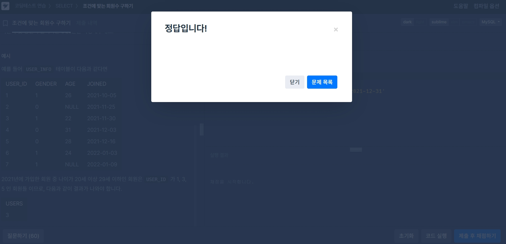

# SQL_BASIC 4주차 정규 과제 

📌SQL_BASIC 정규과제는 매주 정해진 분량의 `초보자를 위한 BigQuery(SQL) 입문` 강의를 듣고 간단한 문제를 풀면서 학습하는 것입니다. 이번주는 아래의 **SQL_Basic_4th_TIL**에 나열된 분량을 수강하고 `학습 목표`에 맞게 공부하시면 됩니다.

**4주차 과제부터는 강의 내용을 정리하는 것과 함께, 프로그래머스에서 제공하는 SQL 문제를 직접 풀어보는 실습도 병행합니다.** 강의에서는 **배운 내용을 정리하고 주요 쿼리 예제를 정리**하며, 프로그래머스 문제는 **직접 풀어본 뒤 풀이 과정과 결과, 배운 점을 함께 기록**해주세요. 완성된 과제는 Github에 업로드하고, 링크를 스프레드시트 'SQL' 시트에 입력해 제출해주세요.

**(수행 인증샷은 필수입니다.)** 

## SQL_BASIC_4th

### 섹션 4. 쿼리 잘 작성하기, 쿼리 작성 템플릿 및 오류를 잘 디버깅하기

### 3-4. 오류를 잘 디버깅하는 방법

## 섹션 5. 데이터 탐색 - 변환

### 4-1. INTRO

### 4-2. 데이터 타입과 데이터 변환(CAST, SAFE_CAST)

### 4-3. 문자열 함수(CONCAT, SPLIT, REPLACE, TRIM, UPPER)

### 4-4. 날짜 및 시간 데이터 이해하기(1) (타임존, UTC, Millisecond, TIMESTAMP/DATETIME)

## 🏁 강의 수강 (Study Schedule)

| 주차  | 공부 범위              | 완료 여부 |
| ----- | ---------------------- | --------- |
| 1주차 | 섹션 **1-1** ~ **2-2** | ✅         |
| 2주차 | 섹션 **2-3** ~ **2-5** | ✅         |
| 3주차 | 섹션 **2-6** ~ **3-3** | ✅         |
| 4주차 | 섹션 **3-4** ~ **4-4** | ✅         |
| 5주차 | 섹션 **4-4** ~ **4-9** | 🍽️         |
| 6주차 | 섹션 **5-1** ~ **5-7** | 🍽️         |
| 7주차 | 섹션 **6-1** ~ **6-6** | 🍽️         |

 

<!-- 여기까진 그대로 둬 주세요-->

---

# 1️⃣ 개념정리

## 3-4. 오류를 디버깅하는 방법

~~~
✅ 학습 목표 :
* 오류의 정의에 대해 설명할 수 있다. 
* 오류 메시지를 보고 디버깅이라는 과정을 수행할 수 있다. 
~~~

### 오류를 바라보는 관점
- 무작정 좌절 X, 더 좋은 길로 나아갈 수 있는 길잡이 역할!

### Syntax Error(문법 오류)
- 문법을 지키지 않아 생기는 오류
- Error Message 보고 해석한 후 **구글/ChatGPT/공식 문서 등의 도움**을 받아 해결방법 찾아보기
- 대표적인 문법 오류
   ~~~sql
   SELECT

   FROM
   WHERE

   --Syntax error: SELECT list must not be empty at [3:1]
   ~~~
  >-> `SELECT`문에는 적어도 하나의 열 지정해야함. 아무것도 지정되지 않아서 생긴 문제.

   ~~~sql
   SELECT
    COUNT(id, kor_name)
   FROM

   --Error: Number of arguments does not match for aggregate function COUNT
   ~~~
  > -> `COUNT` 함수 안에는 한 가지의 인자만 할당 가능.
  ~~~sql
  SELECT
   type1,
   COUNT(id) as cnt
  FROM basic.pokemon

  --SELECT list expression references column type1 which is neither grouped nor aggregated at [2:2]
  ~~~
  > -> `GROUP BY`에 적절한 컬럼을 명시하지 않음.
  ~~~sql
  SELECT
   type1 
  FROM basic.pokemon

  SELECT
   *
  FROM basic.pokemon

  --Syntax error: Expected end of input but got keyword SELECT at [5:1]
  ~~~
  > -> 쿼리를 2개 이상 실행하려면 하나의 쿼리의 끝에 **;** 붙여야함.(하나의 쿼리에는 `SELECT`문 1개!) 
  ~~~sql
  SELECT
   * 
  FROM basic.trainer LIMIT 10
  WHERE 
   id = 3
  
  --Syntax error: Expected end of input but got keyword WHERE at [4:1]
  ~~~
  > -> LIMIT 함수는 쿼리문의 맨 마지막에 있어야함.

https://zzsza.github.io/bigquery/ -> 추가적인 오류 업데이트

## 4-2. 데이터 타입과 데이터 변환(CAST, SAFE_CAST)

~~~
✅ 학습 목표 :
* 데이터 타입의 종류를 설명할 수 있다. 
* 데이터 타입을 변환하는 방법을 설명할 수 있다. 
~~~

### 데이터 타입 
- 숫자 (ex. 1, -4, 3.14,...)

- 문자 (ex. "Apple", "조윤서",...)
- 시간, 날짜 (ex. 2024-05-06, 2025-09-27 01:27,...)
- 부울(Bool) (ex. True, False)
- 그 외에도 JSON, ARRAY등 많지만 일단 기본적인 타입 익힌 후 추후에 확장!

### 데이터 타입이 중요한 이유
#### 보이는 것과 저장된 것의 차이가 존재함
- 엑셀의 빈 값: "" OR NULL

- 1: 1 OR "1"
- 2023-12-31: DATE 2023-12-31 OR "2023-12-31"

-> 내 생각과 다르면 자료 타입을 알맞게 변경해야함

### 자료 타입 변경하기
#### `CAST` : 원하는 데이터 타입으로 자료 변환해주는 함수
~~~sql
SELECT
 CAST(1 AS STRING) --숫자 1을 문자 "1"로 변경
~~~
#### `SAFE_CAST` : CAST와 동일하나 변환이 실패할 경우 NULL 반환
- `CAST` 함수는 변환이 실패하면 Error이 뜨는 반면, `SAFE_CAST`는 NULL로 알아서 반환
~~~sql
SELECT
 CAST("조윤서" AS INT64) --NULL값 반환
~~~

### 수학 함수

https://cloud.google.com/bigquery/docs/reference/standard-sql/mathematical_functions

-> 수학 함수 다 암기할 필요 X, 필요한 거 있으면 그때그때 찾아보기

**Tip)** 나누기 연산을 할 경우 `SAFE_DIVIDE(x,y)` 함수 사용하기
- x,y중 하나라도 0인 경우 zero error 대신 NULL값으로 반환 

## 4-3. 문자열 함수(CONCAT, SPLIT, REPLACE, TRIM, UPPER)

~~~
✅ 학습 목표 :
* 문자열 함수들의 종류를 이해하고 어떠한 상황에서 사용하는지 설명할 수 있다. 
~~~

### 문자열 붙이기: `CONCAT`

~~~sql
CONCAT(컬럼1, 컬럼2,...)
~~~

### 문자열 분리하기: `SPLIT`

~~~sql
SPLIT("문자열 원본", "나눌 기준이 되는 단어/기호")
~~~

`SPLIT`의 결과물은 배열(ARRAY)형태이다. 

### 문자열에서 특정 단어 수정하기: `REPLACE`

~~~sql
REPLACE("문자열 원본", "찾을 단어", "바꿀 단어")
~~~

### 문자열 자르기: `TRIM`

~~~sql
TRIM("문자열 원본", "자를 단어")
~~~

### 문자열에서 소문자를 대문자로 바꾸기: `UPPER`

~~~sql
UPPER("문자열 원본")
~~~

## 4-4. 날짜 및 시간 데이터 이해하기(1) (타임존, UTC, Millisecond, TIMESTAMP/DATETIME)

~~~
✅ 학습 목표 :
* 날짜 및 시간 데이터 타입과 UTC의 개념을 설명할 수 있다. 
* DATE, DATETIME, TIMESTAMP 에 대해서 설명할 수 있다.
* 시간함수들의 종류와 시간의 차이를 추출하는 방법을 설명할 수 있다. 
~~~

### 날짜 및 시간 데이터 타입
**DATE**: DATE만 표시하는 데이터 
- Ex) 2025-09-27

**DATETIME**: DATE와 TIME 둘다 표시하는 데이터
- 타임존 정보 없음

- Ex) 2025-09-27 19:41:34 UTC

**TIMESTAMP**: 날짜와 무관하게 TIME만 표시하는 데이터
- 타임존 정보 있음
- UTC부터 경과한 시간을 나타내는 값

- Ex) 19:41:34 UTC

### 타임존
**GMT**
- 영국의 그리니치 천문대를 기준으로 시간대 구분 -> 주로 영국 근처에서 활용됨

- 한국 시간: GMT+9

**UTC (Universal Time Coordinated)**
- 국제적인 표준 시간

- 한국시간: UTC+9

### Millisecond & Microsecond
**millisecond(ms)**
- 1/1000초

- 빠른 반응이 필요한 분야에서 사용(일반 초단위보다 더 정확)
- Millisecond -> TIMESTAMP -> DATETIME으로 변경

**microsecond(µs)**
- 1/1000ms 

**쿼리에서 변환**
~~~sql
SELECT
 TIMESTAMP_MILLIS(1704176819711) AS milli_to_timestamp,
 TIMESTAMP_MICROS(1704176819711000) AS micro_to_timestamp,
 DATETIME(TIMESTAMP_MILLIS(1704176819711)) AS datetime,
 DATETIME(TIMESTAMP_MILLIS(1704176819711), "Asia/Seoul") AS datetime_asia

--milli_to_timestamp: 2024-01-02 06:26:59.711000 UTC -> 타임존 UTC 기준으로 저장
--datetime: 2024-01-02T06:26:59.711000 -> 지역 명시안하면 UTC 기준으로 표출
--datetime_asia: 2024-01-02T15:26:59.711000 -> Seoul에 맞게 시간 변환해서 표출
~~~
TIMESTAMP -> DATETIME 변환할 때 꼭 타임존 명시!

### TIMESTAMP VS DATETIME

~~~sql
SELECT
 CURRENT_TIMESTAMP() AS timestamp,
 DATETIME(CURRENT_TIMESTAMP(), "Asia/Seoul") AS datetime

--timestamp: 2025-09-27 12:18:56.768956 UTC
--datetime: 2025-09-27T21:18:56.768956
~~~
TIMESTAMP는 타임존이 UTC 기준으로 나옴: 2025-09-27 12:18:56.768956 **UTC**

그러나 DATETIME은 우리가 설정한 타임존으로 나옴: 2025-09-27**T**21:18:56.768956

 

 

---

# 2️⃣ 확인문제 & 문제 인증

## 프로그래머스 문제 

> 조건에 맞는 회원 수 구하기 (SELECT, COUNT) 
>
> **먼저 문제를 풀고 난 이후에 확인 문제를 확인해주세요**
>
> 문제 링크 
>
> :  https://school.programmers.co.kr/learn/courses/30/lessons/131535#

## 문제 1

> **🧚Q. 프로그래머스 문제를 풀던 서현이는 여러 번의 시행착오 끝에 결국 혼자 해결하기 어려워 오류 메시지를 공유하며 도움을 요청했습니다. 여러분들이 오류 메시지를 확인하고, 해당 SQL 쿼리에서 어떤 부분이 잘못되었는지 오류 메시지를 해석하고 찾아 설명해주세요.**

~~~sql
# 조건에 맞는 회원 수 구하기 (SELECT, COUNT) 
# 서현이의 SQL 첫 번째 풀이
SELECT COUNT(AGE, JOINED)
FROM USER_INFO
WHERE AGE BETWEEN 20 AND 29
  AND JOINED BETWEEN '2021-01-01' AND '2021-12-31';
  
오류 메시지 : Error: Number of arguments does not match for aggregate function COUNT
 
# 수정하고 난 이후 두 번째 풀이
SELECT AGE, COUNT(*)
FROM USER_INFO
WHERE AGE BETWEEN 20 AND 29
  AND JOINED BETWEEN '2021-01-01' AND '2021-12-31';
  
오류 메시지 : SELECT list expression references column AGE which is neither grouped nor aggregated
~~~

~~~
1. COUNT함수에는 하나의 인자만 들어갈 수 있다. 따라서 COUNT(AGE, JOINED)는 올바르지 않은 표현이다.
2. SELECT 절의 AGE가 그룹화되지 않았다. 만약 AGE 칼럼도 조회하고싶다면 GROUP BY AGE를 작성해줘야한다. 
~~~

### 🎉 수고하셨습니다.
