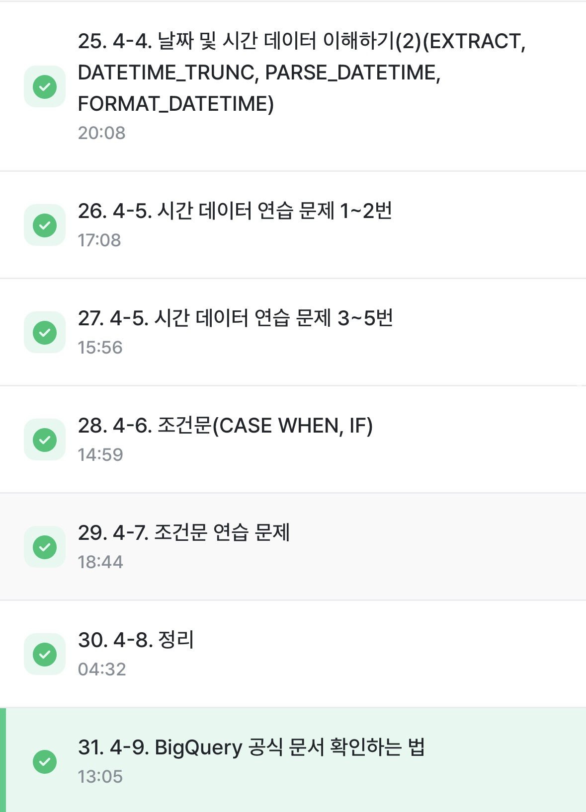

# SQL_BASIC 5주차 정규 과제 

📌SQL_BASIC 정규과제는 매주 정해진 분량의 `초보자를 위한 BigQuery(SQL) 입문` 강의를 듣고 간단한 문제를 풀면서 학습하는 것입니다. 이번주는 아래의 **SQL_Basic_5th_TIL**에 나열된 분량을 수강하고 `학습 목표`에 맞게 공부하시면 됩니다.

**5주차 과제는 문제 풀이를 중심으로**, 강의에서 제시된 예제 문제 중 **3 문제 이상을 선택하여 직접 풀어본 뒤**, 강의 영상의 풀이와 비교해 **틀린 부분, 맞은 부분, 새롭게 배운 개념**을 구체적으로 정리해주세요. (적어도 4문제는 정리해야 합니다.) 완성된 과제는 Gihub에 업로드하고, 링크를 스프레드시트 'SQL' 시트에 입력해 제출해주세요.

**(수행 인증샷은 필수입니다.)** 


## SQL_BASIC_5th

### 섹션 5. 데이터 탐색 - 변환

### 4-4. 날짜 및 시간 데이터 이해하기(2) (EXTRACT, DATETIME_TRUNC, PARSE_DATETIME, FROMAT_DATETIME)

### 4-5. 시간 데이터 연습문제 1~2번

### 4-5. 시간 데이터 연습문제 3~5번

### 4-6. 조건문 (CASE WHEN, IF)

### 4-7. 조건문 연습 문제

### 4-8. 정리

### 4-9. BigQuery 공식 문서 확인하는 법

(강의에서 연습문제가 많아서 따로 프로그래머스 문제 과제는 없습니다.)


## 🏁 강의 수강 (Study Schedule)

| 주차  | 공부 범위              | 완료 여부 |
| ----- | ---------------------- | --------- |
| 1주차 | 섹션 **1-1** ~ **2-2** | ✅         |
| 2주차 | 섹션 **2-3** ~ **2-5** | ✅         |
| 3주차 | 섹션 **2-6** ~ **3-3** | ✅         |
| 4주차 | 섹션 **3-4** ~ **4-4** | ✅         |
| 5주차 | 섹션 **4-4** ~ **4-9** | ✅         |
| 6주차 | 섹션 **5-1** ~ **5-7** | 🍽️         |
| 7주차 | 섹션 **6-1** ~ **6-6** | 🍽️         |

<br>


<!-- 여기까진 그대로 둬 주세요-->

---

# 4-4. 날짜 및 시간 데이터 이해하기(2) (EXTRACT, DATETIME_TRUNC, PARSE_DATETIME, FROMAT_DATETIME)

~~~
✅ 학습 목표 :
* 날짜 및 시간 데이터에 대해서 더 자세히 설명할 수 있다. 
* CURRENT_TIME, EXTRACT, DATETIME_TRUNC, PARSE_DATETIME, FROMAT_DATETIME 을 설명할 수 있다. 
~~~

## DATETIME 함수 - `CURRENT_DATETIME` 

**현재 DATETIME 출력**
~~~sql
SELECT
 CURRENT_DATE() AS current_date,
 CURRENT_DATE("Asia/Seoul") AS asia_date,
 CURRENT_DATETIME() AS curent_datetime, 
 CURRENT_DATETIME("Asia/Seoul") AS current_datetime_asia

-- current_date: 2025-10-31
-- asia_date: 2025-10-31
-- curent_datetime: 2025-10-31T13:49:02.025478
-- current_datetime_asia: 2025-10-31T22:49:02.025478
~~~

- TIMEZONE 설정 안하면 UTC 기준으로 출력됨. 
- 한국시간은 UTC 기준 +9시간이니 한국기준 0시~8시 59분까지는 UTC 기준과 날짜도 다름 -> 항상 타임존 주의!

## DATETIME 함수 - `EXTRACT`

**DATETIME에서 특정 부분만 추출하고 싶은 경우**

~~~sql
EXTRACT(원하는파트 FROM datetime_expression)
~~~

- '원하는파트'에 들어갈 수 있는 값들: 링크!!!!!!

### 기본 DATETIME 정보 추출
~~~sql
SELECT 
  EXTRACT(DATE FROM DATETIME "2024-01-02 14:00:00") AS date, -- 2024-01-02
  EXTRACT(YEAR FROM DATETIME "2024-01-02 14:00:00") AS year, -- 2024
  EXTRACT(MONTH FROM DATETIME "2024-01-02 14:00:00") AS month, -- 1
  EXTRACT(DAY FROM DATETIME "2024-01-02 14:00:00") AS day, -- 2
  EXTRACT(HOUR FROM DATETIME "2024-01-02 14:00:00") AS hour, -- 14
  EXTRACT(MINUTE FROM DATETIME "2024-01-02 14:00:00") AS minute -- 0
~~~

### 요일 추출
`DAYOFWEEK`: 한 주의 첫날이 일요일인 1~7 사이의 값을 반환
~~~sql
SELECT 
  EXTRACT(DAYOFWEEK FROM DATETIME "2025-10-31 14:00:00") AS dayofweek1, -- 6(금요일)
  EXTRACT(DAYOFWEEK FROM DATETIME "2024-10-30 14:00:00") AS dayofweek2, -- 5(목요일)
  EXTRACT(DAYOFWEEK FROM DATETIME "2024-11-01 14:00:00") AS dayofweek3, -- 7(토요일)
  EXTRACT(DAYOFWEEK FROM DATETIME "2024-11-02 14:00:00") AS dayofweek4 -- 1(일요일)
~~~

## DATETIME 함수 - `DATETIME_TRUNC`

**날짜/시간을 특정 단위 시작점으로 정렬**
~~~sql
SELECT
 DATETIME_TRUNC(DATETIME "2025-10-31 13:19:35", YEAR) AS year_trunc, -- 2025-01-01T00:00:00
 DATETIME_TRUNC(DATETIME "2025-10-31 13:19:35", MONTH) AS day_trunc, -- 2025-10-01T00:00:00
 DATETIME_TRUNC(DATETIME "2025-10-31 13:19:35", DAY) AS day_trunc, -- 2025-10-31T00:00:00
 DATETIME_TRUNC(DATETIME "2025-10-31 13:19:35", HOUR) AS hour_trunc -- 2025-10-31T13:00:00
~~~
자른 이후의 가장 작은 값을 추출 -> YEAR은 2025에서 자르고, 그 뒤 값들은 가능한 가장 작은 값으로 표기

> `EXTRACT`는 integer을 반환하나 `DATETIME_TRUNC`는 DATETIME 형식으로 반환

## DATETIME 함수 - `PARSE_DATETIME`

**문자열로 저장된 DATETIME을 DATETIME 타입으로 바꾸고 싶은 경우**
~~~sql
SELECT
 PARSE_DATETIME("%Y-%m-%d %H:%M:%S", "2025-10-31 14:23:34") AS parse_datetime -- 2025-10-31T14:23:34
~~~
`%Y-%m-%d %H:%M:%S`: 문자열 형식 -> 문자열이 어떤 구조인지 알려줌

`2025-10-31 14:23:34`: 문자열로 저장된 DATETIME (변환대상)

## DATETIME 함수 - `FORMAT_DATETIME`

**DATETIME 타입 데이터를 특정 형태의 문자열 데이터로 바꾸고 싶은 경우**
~~~sql
SELECT
 FORMAT_DATETIME("%c", DATETIME "2025-10-31 14:23:34") AS format_datetime -- Fri Oct 31 14:23:34 2025
~~~

`%c`: 원하는 문자열 형식

`2025-10-31 14:23:34`: DATETIME 타입의 데이터

> Format Elements 문서 참조: https://docs.cloud.google.com/bigquery/docs/reference/standard-sql/format-elements

## DATETIME 함수 - `LAST_DAY`

**마지막 DAY를 알고싶은 경우**
-> 보통 자동으로 월의 마지막 값을 계산해서 특정 연산 할 때 사용

~~~sql
SELECT
 LAST_DAY(DATETIME "2025-10-31 14:23:34") AS last_day, -- 2025-10-31
 LAST_DAY(DATETIME "2025-10-31 14:23:34", MONTH) AS last_day_month, -- 2025-10-31
 LAST_DAY(DATETIME "2025-10-31 14:23:34", WEEK) AS last_day_week, -- 2025-11-01
 LAST_DAY(DATETIME "2025-10-31 14:23:34", WEEK(SUNDAY)) AS last_day_week_sun, -- 2025-11-01
 LAST_DAY(DATETIME "2025-10-31 14:23:34", WEEK(MONDAY)) AS last_day_week_mon -- 2025-11-02
~~~
- MONTH(`LAST_DAY` 함수의 디폴트): DATETIME이 속한 달의 마지막 날을 출력
- WEEK: DATETIME이 속한 주의 마지막 날을 출력
  - 디폴트는 `WEEK(SUNDAY)`: 한 주의 시작을 일요일이라고 지정

## DATETIME 함수 - `DATETIME_DIFF`
**두 DATETIME의 차이를 알고싶은 경우**
~~~sql
SELECT
  DATETIME_DIFF(first_datetime, second_datetime, DAY)   AS day_diff1, -- 1187
  DATETIME_DIFF(second_datetime, first_datetime, DAY)   AS day_diff2, -- -1187
  DATETIME_DIFF(first_datetime, second_datetime, MONTH) AS month_diff, -- 39
  DATETIME_DIFF(first_datetime, second_datetime, WEEK)  AS week_diff -- 170
FROM (
  SELECT
    DATETIME "2024-04-02 10:20:00" AS first_datetime,
    DATETIME "2021-01-01 15:00:00" AS second_datetime
)
~~~

## 정리
### 날짜 및 시간 데이터타입
- DATE: 날짜 데이터
- DATETIME: DATE + TIME. 타임존 정보 없음
- TIMESTAMP: DATE + TIME + 타임존 정보
- UTC: 국제적인 표준 시간. 한국은 UTC + 9
- Millisecond: 1/1000초
- Microsecond: 1/1000ms

### 시간 데이터 타입 변환
- Millisecond => TIMESTAMP:`TIMESTAMP_MILLIS`
- Microsecond => TIMESTAMP:`TIMESTAMP_MICROS`
- TIMESTAMP => DATETIME: `DATETIME`
- 문자열 => DATETIME: `PARSE_DATETIME`
- DATETIME => 문자열: `FORMAT_DATETIME`

### DATETIME 함수
- 현재 DATETIME: `CURRENT_DATETIME`
- DATETIME 특정 부분 추출: `EXTRACT`
- DATETIME 특정 부분 자르기: `DATETIME_TRUNC`
- DATETIME 차이 구하기: `DATETIME_DIFF`

**DATETIME 함수는 대부분 TIMESTAMP, DATE에도 동일하게 사용 가능**

**대표적인 함수만 기억하고 필요할 때 추가로 찾아보자**

# 4-6. 조건문(CASE WHEN, IF)

~~~
✅ 학습 목표 :
* 조건문 함수의 기능을 이해하고, 설명할 수 있다. 
~~~

## 조건문
### 조건문이란?
- 특정 조건이 충족되면 어떤 행동을 하자
- 조건에 따라 값을 다르게 표시하고 싶을 때
### 조건문 함수가 사용되는 이유
- 특정 카테고리를 하나로 합치는 전처리가 필요할 때
  - 1~6학년 데이터에서 1~3학년은 저학년, 4~6학년은 고학년으로 합칠 때
- 이런 일이 일어나는 이유
  - 대체로 데이터를 저장하는 팀과 분석하는 팀이 나뉨
  - 합쳐서 저장하면 분석할 때 임의로 쪼개기 어려우니 보통 가장 낮은 단위의 원본 데이터로 저장돼있음

## 조건문 함수 - `CASE WHEN`
**여러 조건이 있을 때 유용**
~~~sql
SELECT
 CASE
  WHEN 조건1 THEN 조건1일 경우 결과
  WHEN 조건2 THEN 조건2일 경우 결과
  ELSE 그 외일 경우 결과
 END AS 새로운 칼럼 이름
FROM 
.
.
.
~~~


**주의: `CASE WHEN`에서의 순서**
~~~sql
 CASE
  WHEN 조건1 THEN 조건1일 경우 결과
  WHEN 조건2 THEN 조건2일 경우 결과
 ELSE 그 외일 경우 결과
 END AS 새로운_칼럼_이름
~~~
조건1, 조건2에 중복되게 해당하면 앞선 순서를 따라 조건1일 경우 결과로 분류됨!

문자열 함수(특정 단어 추출)에서 문제 자주 발생
## 조건문 함수 - `IF`
**단일 조건일 경우 유용**
~~~sql
IF(조건문, TRUE일때 값, FALSE일 때 값) AS 새로운_칼럼_이름
~~~

 # 4-5. 시간 데이터 연습문제 & 4-7. 조건문 연습 문제

~~~
✅ 학습 목표 :
* 4-5, 4-7 각각에서 두 문제 이상 (최소 4문제) 푼 내용 정리하기
~~~

## 4-5 시간 데이터 연습문제

### 연습문제 1. `catch_date`을 기준으로, 2023년 1월에 포획한 포켓몬의 수를 계산하시오
~~~
# 쿼리를 작성하는 목표, 확인할 지표 : 포켓몬의 수
# 쿼리 계산 방법: COUNT
# 데이터의 기간: 2023년 1월
# 사용할 테이블: trainer_pokemon
# Join KEY: X
# 데이터 특징: 직접 살펴봐야함
 - catch_datetime: 칼럼 이름은 datetime이나 데이터 살펴보면 TIMESTAMP
  => 칼럼 이름만 믿으면 안되고 꼭 직접 확인해봐야함!!!!
 - catch_date: DATE 타입
 - catch_date은 한국시간 기준? UTC 기준?
   - catch_date과 DATE(DATETIME(catch_datetime, "Asia/Seoul"))을 비교해야함
~~~
**catch_date과 catch_datetime 비교**
~~~sql
SELECT
 COUNT(*)
FROM(
SELECT
 id,
 catch_date AS catch_date,
 DATE(DATETIME(catch_datetime, "Asia/Seoul")) AS catch_datetime_kr_date
FROM 
 basic.trainer_pokemon
)
WHERE
 catch_date != catch_datetime_kr_date
~~~
-> 쿼리 출력 결과 catch_date != catch_datetime_kr_date인 행 141개 => 한국 시간 기준으로 하려면 catch_datetime을 'Asia/Seoul'로 맞춰서 이용해야함!!

**답**
~~~sql
SELECT
 COUNT(DISTINCT id) AS cnt
FROM
 basic.trainer_pokemon
WHERE
 EXTRACT(YEAR FROM DATETIME(catch_datetime, "Asia/Seoul")) = 2023 -- catch_datetime은 TIMESTAMP로 저장되어있으니 DATETIME으로 변환해야함
 AND EXTRACT(MONTH FROM DATETIME(catch_datetime, "Asia/Seoul")) = 1
~~~


### 연습문제 2. `battle_datetime`을 기준으로, 오전 6시와 오후 6시 사이에 일어난 배틀의 수를 계산하시오.
~~~
# 쿼리를 작성하는 목표, 확인할 지표: 배틀의 수
# 쿼리 계산 방법: COUNT
# 데이터의 기간: 오전 6시~오후 6시
# 사용할 테이블: battle
# Join KEY: X
# 데이터 특징
 - battle_date: battle_datetime 기준의 DATE
 - battle_datetime: DATETIME
 - battle_timestamp: TIMESTAMP
 - 그럼 battle_datetime과 DATETIME(battle_timestamp, "Asia/Seoul") 같은지 검증 필요!
~~~
**battle_datetime과 DATETIME(battle_timestamp, "Asia/Seoul") 같은지 검증**
~~~sql
SELECT
 COUNT(*)
FROM(
SELECT
 id,
 battle_datetime,
 DATETIME(battle_timestamp, "Asia/Seoul") AS battle_timestamp_datetime
FROM 
 basic.battle
)
WHERE 
 battle_datetime != battle_timestamp_datetime
--------------------------------------------------------
SELECT
 COUNTIF(battle_datetime = DATETIME(battle_timestamp, "Asia/Seoul")) AS same,
 COUNTIF (battle_datetime != DATETIME(battle_timestamp, "Asia/Seoul")) AS not_same
FROM
 basic.battle
~~~

**답**
~~~sql
SELECT
 COUNT(*) AS cnt
FROM 
 basic.battle
WHERE
 EXTRACT(HOUR FROM battle_datetime) BETWEEN 6 and 18
 --EXTRACT(HOUR FROM battle_datetime) >= 6
 --AND EXTRACT(HOUR FROM battle_datetime) <= 18
~~~
추가문제) 시간대별 배틀수 집계
~~~sql
SELECT
 battle_hr,
 COUNT(DISTINCT id) AS battle_cnt
FROM(
SELECT
 *,
 EXTRACT(HOUR FROM battle_datetime) AS battle_hr
FROM
 basic.battle
)
GROUP BY
 battle_hr
ORDER BY
 battle_hr
~~~


### 연습문제 3. 각 트레이너별로 처음 포켓몬을 포획한 날짜를 찾고, 그 날짜를 'DD/MM/YYYY' 형태로 출력하시오.
~~~
# 쿼리를 작성하는 목표, 확인할 지표: 포획한 첫날 찾기, 날짜를 특정 형식으로 변환
# 쿼리 계산 방법: MIN, FORMAT_DATETIME
# 데이터의 기간: X
# 사용할 테이블: trainer_pokemon
# Join KEY: X
# 데이터 특징: catch_date은 UTC 기준. catch_datetime은 TIMESTAMP 타입
~~~

**답**
~~~sql
SELECT
 trainer_id,
 FORMAT_DATE("%d/%m/%Y", first_catch_date) AS format_date -- FORMAT_DATETIME 공식 문서 참조
FROM(
SELECT
 trainer_id,
 MIN(DATE(catch_datetime, "Asia/Seoul")) AS first_catch_date
FROM
 basic.trainer_pokemon
GROUP BY
 trainer_id
)
ORDER BY 
 trainer_id
~~~
참고) `ORDER BY`는 연산이 많이 소요되는 함수 -> 웬만해서는 가장 바깥에(나중에) 실행하는 것이 효율적임.


### 연습문제 4. battle_date을 기준으로 요일별로 배틀이 얼마나 자주 일어났는지 계산하시오.
~~~
# 쿼리를 작성하는 목표, 확인할 지표: 날짜를 요일로 변환, 요일별 배틀수 찾기
# 쿼리 계산 방법: EXTRACT, COUNT
# 데이터의 기간: X
# 사용할 테이블: battle
# Join KEY: X
# 데이터 특징: battle_date과 battle_datetime은 둘다 한국시간 기준.
~~~

**답**
~~~sql
SELECT
 dayofweek_battle, 
 COUNT(DISTINCT id) AS battle_cnt
FROM(
SELECT
 id,
 EXTRACT(DAYOFWEEK FROM battle_datetime) AS dayofweek_battle
FROM
 basic.battle
)
GROUP BY
 dayofweek_battle
ORDER BY
 dayofweek_battle
~~~

### 연습문제 5. 트레이너가 포켓몬을 처음으로 포획한 날짜와 마지막으로 포획한 날짜의 간격이 큰 순으로 정렬하는 쿼리 작성하시오.
~~~
# 쿼리를 작성하는 목표, 확인할 지표: 처음으로 포획한 날짜, 마지막으로 포획한 날짜, 두 날짜의 차이 
# 쿼리 계산 방법: MIN, MAX, DATETIME_DIFF, ORDER BY
# 데이터의 기간: X
# 사용할 테이블: trainer_pokemon
# Join KEY: X
# 데이터 특징: catch_date는 UTC, catch_datetime은 TIMESTAMP
~~~

**답**
~~~sql
SELECT
 *,
 DATETIME_DIFF(max_date, min_date, DAY) AS diff
 -- 네이버 D-DAY 계산기 등을 이용해서 diff가 맞게 출력되었는지 확인!
FROM(
SELECT
 trainer_id,
 MIN(DATETIME(catch_datetime, "Asia/Seoul")) AS min_date,
 MAX(DATETIME(catch_datetime, "Asia/Seoul")) AS max_date
FROM
 basic.trainer_pokemon
GROUP BY
 trainer_id
)
ORDER BY
 diff DESC
~~~
<br>

## 4-7 조건문 함수 연습문제

### 연습문제 1. 포켓몬의 스피드가 70 이상이면 ’빠름‘, 그렇지 않으면 ‘느림’으로 표시하는 새로운 ‘speed_category’ 칼럼을 만드시오.
```
# 쿼리를 작성하는 목표, 확인할 지표: Speed 칼럼에 조건을 걸어 speed_category 만들기
# 쿼리 계산 방법: IF
# 데이터의 기간: X
# 사용할 테이블: pokemon
# Join KEY: X
# 데이터 특징: MIN speed는 5, MAX speed는 140
(MIN, MAX 함수 이용해 구할 수 있음)
```

**답**
```sql
SELECT
 id,
 kor_name,
 speed,
 IF(speed >= 70, "빠름", "느림") AS speed_category
FROM
basic.pokemon
```
### 연습문제 3. 각 포켓몬의 총점(total)을 기준으로, 300 이하면 'Low', 301에서 500 사이면 'Medium', 501 이상이면 'High'로 분류하시오.
```
# 쿼리를 작성하는 목표, 확인할 지표: total의 값을 기준으로 분류
# 쿼리 계산 방법: CASE WHEN
# 데이터의 기간: X
# 사용할 테이블: pokemon
# Join KEY: X
# 데이터 특징: total 칼럼은 INTEGER
```

```sql
SELECT
 CASE 
  WHEN total >= 501 THEN 'High'
  WHEN total BETWEEN 301 AND 500 THEN 'Medium'
  ELSE 'Low'
 END AS total_grade
FROM
 basic.pokemon
```





<br>

<br>

---

# 확인문제

## 문제 1

> **🧚Q. 광윤이는 사용자 로그 데이터에서, 2021년에 접속한 사용자 수를  집계하려고 했습니다. 그는 여러 SQL 쿼리들을 실행해봤지만, 그 중 일부는 문법적으로 잘못되어 실행되지 않았습니다. 다음 보기 중 틀린 쿼리를 모두 골라보세요 (복수 선택 가능)**

~~~sql
1. SELECT COUNT(*)  
   FROM user_log  
   WHERE EXTRACT(YEAR FROM login_date) = 2021;

2. SELECT EXTRACT(YEAR FROM login_date), COUNT(*)  
   FROM user_log  
   GROUP BY EXTRACT(YEAR FROM login_date);

3. SELECT COUNT(*)  
   FROM user_log  
   WHERE login_date = '2021';

4. SELECT COUNT(*)  
   FROM user_log  
   WHERE login_date BETWEEN '2021-01-01' AND '2021-12-31';
~~~

<!-- 틀린쿼리에 대한 오류의 원인도 같이 작성해주세요. 문제에서 제공된 login_data 컬럼은 DATE type의 데이터를 가지고 있다고 가정하시면 됩니다. -->

~~~
3: login_data는 DATA 타입이기에 정수로 바꾼다음 비교가 가능하다.
~~~


## 문제 2

> **🧚Q. 혜성이는 포켓몬 타입에 따라 설명을 부여하는 쿼리를 작성했습니다. type 1 컬럼의 값에 따라 조건을 분기했으며, 다음 SQL 쿼리를 실행했습니다.**

~~~sql
SELECT name,
       CASE 
         WHEN type1 = 'Fire' THEN 'Hot'
         WHEN type1 = 'Water' THEN 'Cool'
         ELSE 'Normal'
       END AS type_description
FROM pokemon;
~~~

> **다음 중 type_description의 결과가 'Normal'로 출력될 포켓몬은?**

| **name**   | **type1** |
| ---------- | --------- |
| Pikachu    | Electric  |
| Charmander | Fire      |
| Squirtle   | Water     |
| Bulbasaur  | Grass     |

<!-- 근거와 함께 답을 작성해주세요 -->

~~~
Pikachu, Bulbasaur. 
Fire과 Water에 해당하지 않는 타입을 가졌기에 조건 중 ELSE에 해당하고, 결과적으로 'Normal'로 출력된다.
~~~


<br>

### 🎉 수고하셨습니다.
